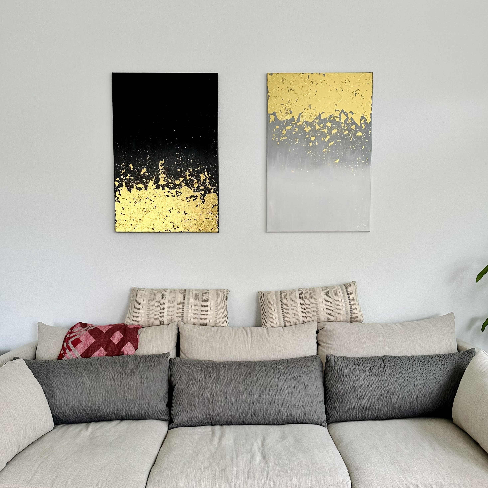
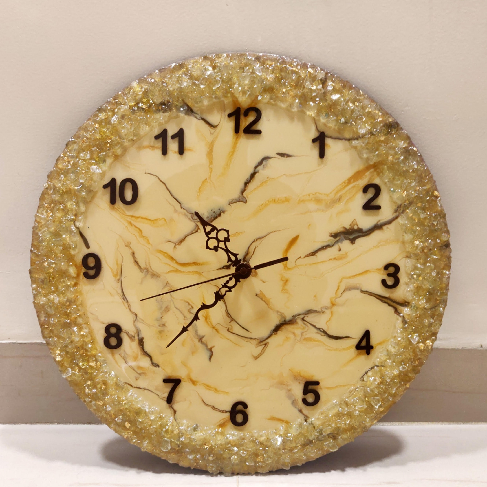
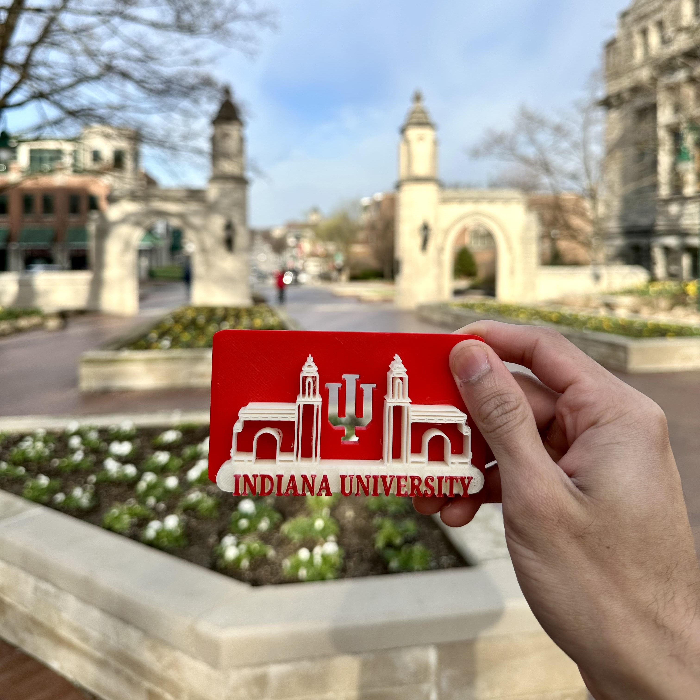
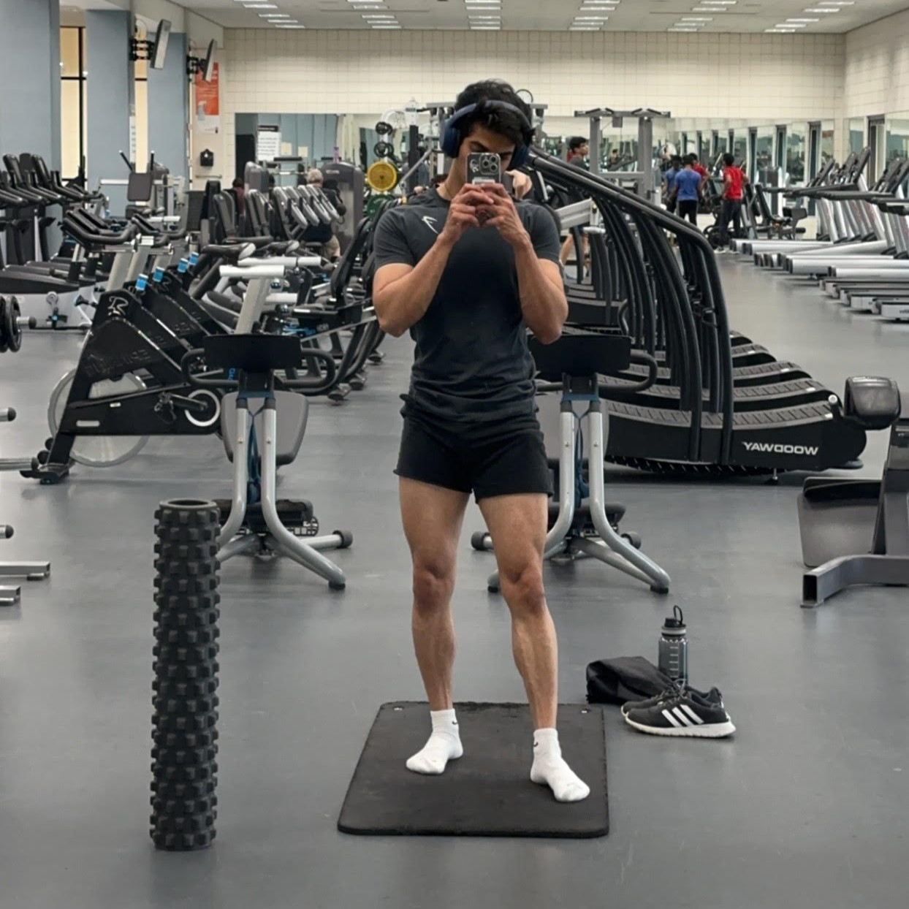
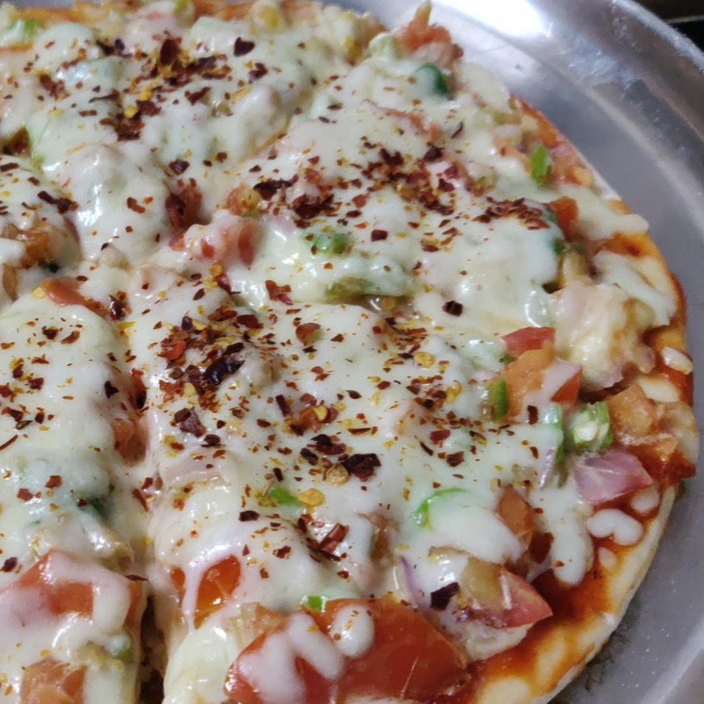
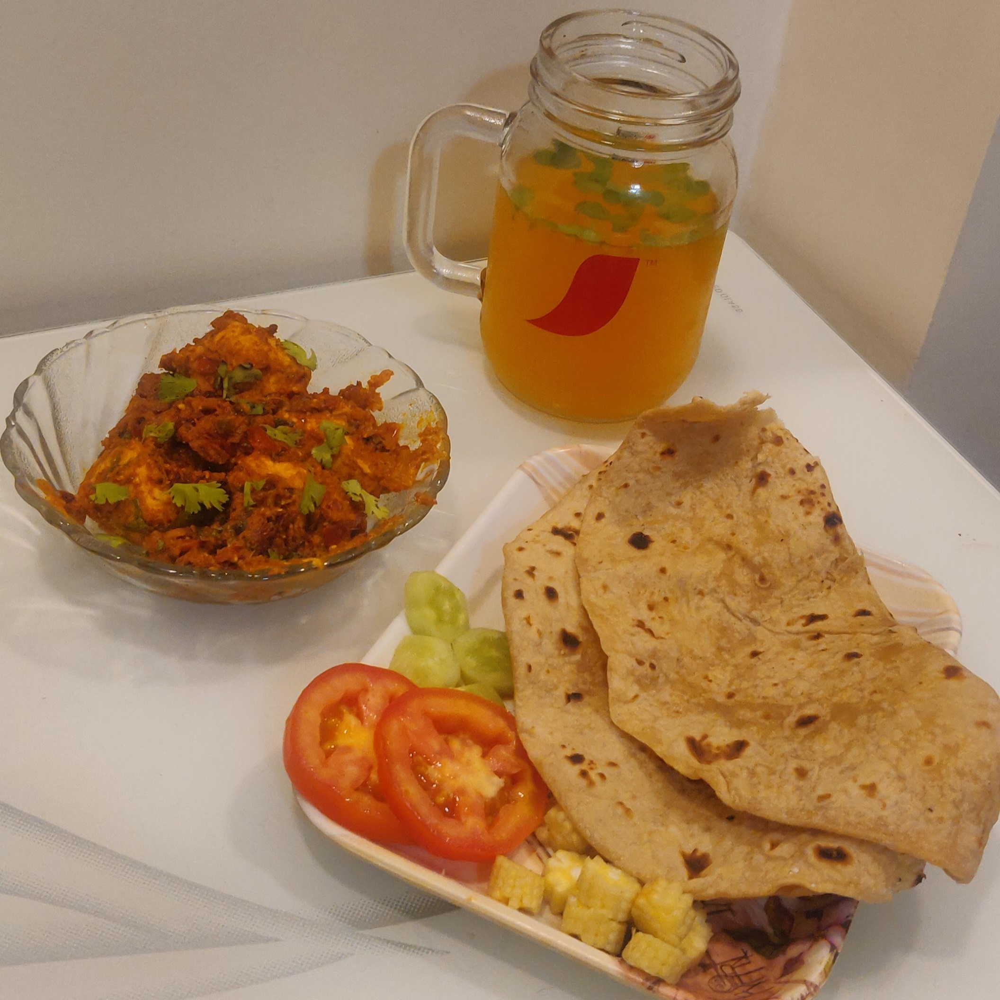
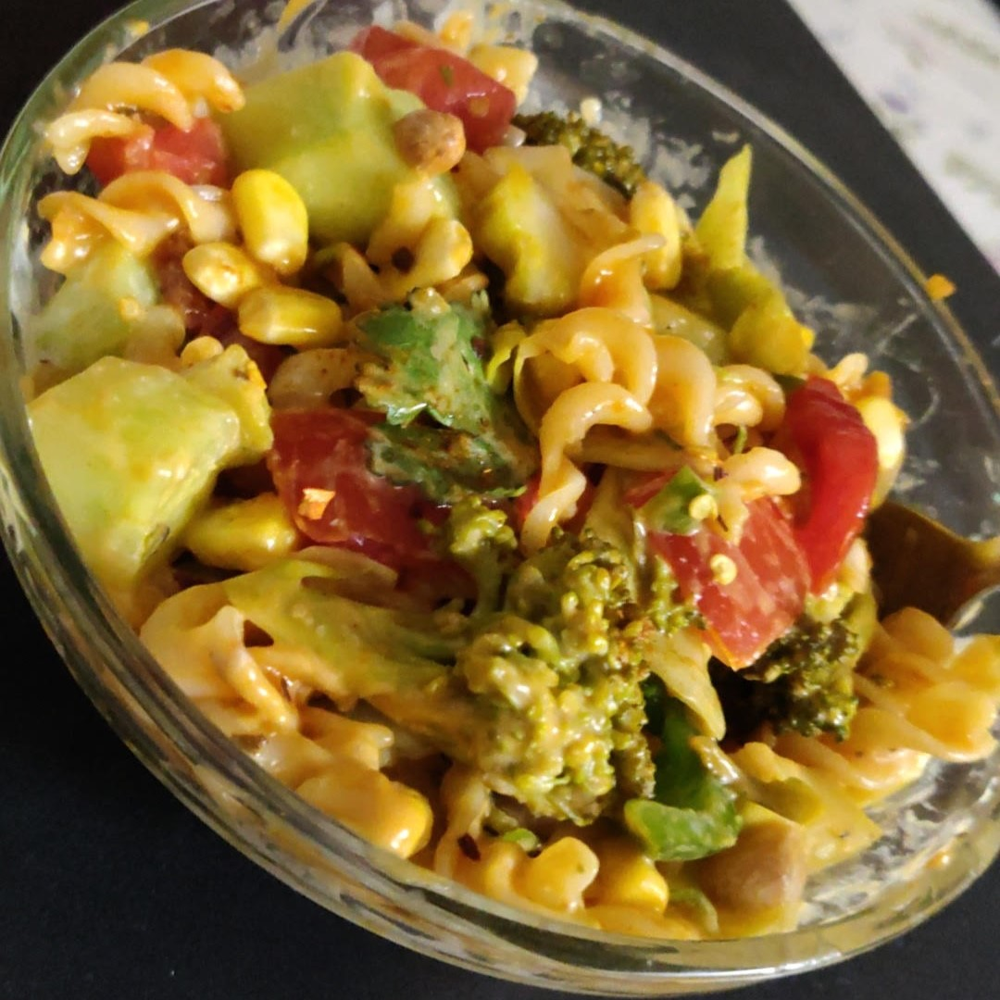

## Education

 
  <h4 style="display: inline-block; float: left">Indiana University, Bloomington, IN, United States</h4>
  <h6 style="display: inline-block; float: right">August 2022 – May 2024</h6>

 
  
Master of Science in Data Science

  <h6 style="display: inline-block; float: right">CGPA: 3.97/4.0</h6>

  

    
Coursework

    <ul>
      <li>Applied Machine Learning</li>
      <li>Applied Database Technologies</li>
      <li>Statistics</li>
      <li>Data Visualization</li>
      <li>Big Data Technologies</li>
      <li>Natural Language Processing</li>
      <li>Music Data Mining</li>
      <li>Social Media Informatics</li>
    </ul>
  

 

 
  <h4 style="display: inline-block; float: left">University of Mumbai, Mumbai, India</h4>
  <h6 style="display: inline-block; float: right">July 2014 – May 2018</h6>

  
Bachelor of Engineering in Information Technology

  <h6 style="display: inline-block; float: right"> CGPA: 8.58/10 </h6>

  

    
Coursework

    <ul>
      <li>Object Oriented Programming</li>
      <li>Data Structures and Algorthms</li>
      <li>Database Concepts</li>
      <li>Operating Systems</li>
      <li>Computer Networks</li>
      <li>Applied Mathematics</li>
      <li>Web Technologies</li>
      <li>Data Mining and Business Intelligence</li>
      <li>Artificial Intelligence</li>
      <li>Cloud Computing</li>
      <li>Software Engineering</li>
      <li>Virtual Reality</li>
    </ul>
  

 

  
## Technical Skills

| | |  |  |  |  |  ||

| |  |  |  |  |  |  |  |  | |

| | |  |  |  |  |  |  |  | | |

| |  |  |  |  |  |  |  |  | |

| | |  |  |  |  |  |  | | |

| | | |  |  |  |  | | | |

## Work Experience

 
  <h4 style="display: inline; float: left">Indiana University School of Medicine, Indianapolis, IN</h4>
  <h6 style="display: inline; float: right">July 2023 – Present</h6>

 

Research Assistant

-	Engineered a robust database system in **Big Query** and **PostgreSQL** by performing data preprocessing on extensive raw datasets of **MIMIC III**, **IV** & **EICU** consisting of over **1 million records**, enabling **seamless querying** to uncover patterns and **prediction** of over **5 types of patient outcomes**.
-	Constructed a comprehensive **data model** for various data types and performed the responsibilities of a **DBA** for **access and privilege management** fostering **efficient collaboration** among **Researchers** & **Data Scientists** to **increase productivity by 30%**.
-	Devised an automated **data pipeline** to streamline **time series** data retrieval by integrating **PySpark**, **Big Query** & **Google Cloud Storage** involving **up-sampling** and **interpolation** techniques to smoothen data and **reduce the missing values by 30%**.
-	Spearheaded the development of a robust **Time Series** machine learning model using **RNN** for predicting critical clinical variables, enhancing the researcher's ability to anticipate **3 types of patient outcomes**.
-	Collaborated with Clinicians & Researchers to review **9 scholarly articles** and gather domain knowledge for refinement of the model's performance.
-	Incorporated **visual representations** to effectively represent the **meaningful clinical features** and **patient demographics** facilitating data analysis.

 

 
  <h4 style="display: inline; float: left">Indiana University Luddy SoICE, Bloomington, IN</h4>
  <h6 style="display: inline; float: right">June 2023 – Present</h6>

 

Associate Instructor

- Worked collaboratively with fellow teaching assistants, and the Professors for course development, grading and query resolution of the students for the **Applied Database Technologies** and **Discrete Mathematics for Computer Science** courses for **3 semesters**.
- Effectively provided one-on-one and group mentoring to **100 graduate and undergraduate students** in , offering clarification on course material and assisting with homework assignments enabling them to achieve their **academic goals**.
- Evaluated students' assignments and exams, providing constructive feedback, helping them achieve excellent grades.
- Assisted in the development of **12 course modules**, learning materials,**7 demonstrations and instructional aids** to enhance the teaching process. ensuring clear understanding among the students.

 

 
  <h4 style="display: inline; float: left">Apisero, Mumbai, India</h4>
  <h6 style="display: inline; float: right">December 2021 – August 2022</h6>

Senior Software Engineer

- Developed comprehensive **API documentations**, **architecture** & **sequence diagrams** for **Enterprise Integration Solutions** using **MuleSoft**, facilitating **seamless implementation** by the developers and testers by adhering best practices in **functional design** in turn leading to better understanding of the **technical requirements**.
- Spearheaded collaboration & coordination with **3 US based clients** and **cross-functional teams** as a **Technical Consultant**, ensuring effective and clear communication to deliver the product as per the **business objectives** and **user requirements** by **rapid prototyping** and working demonstrations resulting in **increased client satisfaction** and retention.
- Demonstrated expertise in creating highly efficient integration interfaces for **REST** & **SOAP** APIs, **JMS**, **Kafka** and cloud environments (**AWS**) by following best practices suggested by **MuleSoft’s C4E** and **API governance** leading to **35% higher usability of APIs**.
- Skilled in designing and developing **API specifications** using RAML and YAML enforcing **reusability of resources** along with securing APIs using **OAuth**, **Two-way SSL** and **Client ID authentication**.
- Created data transformations using **Dataweave** for building a **canonical data model** for various data formats such as **JSON**, **XML**, **Parquet**, **CSV** and **AVRO**, ensuring **data accuracy** and **unified view of data**.

 

 
  <h4 style="display: inline; float: left">Accenture, Mumbai, India</h4>
  <h6 style="display: inline; float: right">October 2018 – December 2021</h6>

Application Development Associate

- Played a key role as an Integration and **API Developer** in a large-scale **SAFe Agile** Project, collaborating with **14 Scrum teams** achieving **100% completion** of the project goals and **user stories** by adhering to **software engineering principles**, **object-oriented design** and **test-driven development**.
- Orchestrated solutions in **MuleSoft 3.x & 4.x** using **API-led connectivity** and **Maven** architecture, ensuring **modularization**, and **dependency management** for efficient & scalable applications along with build automation and deployment for **On-premise environments** using **Jenkins**. 
- Demonstrated exceptional **problem-solving** & **analytical skills** by troubleshooting and resolving approximately **200 SIT defects**, ensuring **timely delivery** of the release **increasing business performance by 20%**.
- Earned recognitions of **Growing Star** & **Day One Star**, for showcasing dedication to **professional growth** & **outstanding contributions**.
- Engaged in providing **code reviews** and participating in **pair programming** sessions with junior team members, fostering **collaboration**, **knowledge sharing**, and **continuous improvement** within the development team.
- Mentored **15 new hires** by facilitating their project onboarding process, contributing to their **professional development** and **project success**.

 

  
## Projects

#### Generative AI based Song Recommendation System ([Application](https://song-recommendation-system.streamlit.app/))

<table>
<tr>
  <td>
    
<!---->
  </td>
  <td>
    <iframe width="320" height="180" src="https://www.youtube.com/embed/MDeuYBwSps0?si=0ozNqRTExLHuaPkQ" title="YouTube video player" frameborder="0" allow="accelerometer; autoplay; clipboard-write; encrypted-media; gyroscope; picture-in-picture; web-share" allowfullscreen></iframe>
  </td>
</tr>
</table>

- Implemented a **Generative Artificial Intelligence** driven song recommendation system integrating **Spotify API** & **Streamlit**, using content-based & collaborative filtering hybrid model approach to leverage cutting-edge natural language processing technology and enhance user experience.
-	Engineered data preprocessing pipelines for performing **NLP** tasks such as named entity recognition, removal of stem words, lemmatization, stemming and analyzing sentiments, relationship between lyrics using Doc2Vec, ensuring the quality of the data of over **1 million songs**.
-	Developed and fine-tuned deep learning models, such as **Convolutional Neural Networks (CNNs)** to extract intricate patterns from the spectrogram of the songs, resulting in enhanced recommendations.

 

#### Unveiling the Artists' Story ([CRNY Dashboard](https://crny-dashboard.onrender.com/))

- Crafted a dynamic and interactive dashboard to delve into the background of artists, featuring their diverse identities and challenges faced through a range of visualizations including **bar charts**, **pie charts**, **violin plot**, **upset plot**, **chord diagrams**, **choropleth map**, **polar charts** & **bubble charts**.
-	Utilized **Python** for **data preprocessing** and visualization, and **Flask** (Dash) app for creating the dashboard to display **10 aggregated visualizations** and **summary statistics** for **engaging** and **informative storytelling** leading to **accurate interpretation** of the Artists’ needs by the organization.
-	Harnessed visualization libraries including **Matplotlib**, **Seaborn** and **Plotly** for creating visualizations with a high level of customization and interactivity, tailored to elevate **user engagement** and refine the overall aesthetic appeal of the dashboard interface.

 

#### BookMyDoc (A Medical Appointment Booking Platform)

<table>
<tr>
  <td>
    
<!---->
  </td>
  <td>
    <iframe align="center" width="320" height="180" src="https://www.youtube.com/embed/30WF6MoWPl0?si=6VqYe88JVpPkIeul" title="YouTube video player" frameborder="0" allow="accelerometer; autoplay; clipboard-write; encrypted-media; gyroscope; picture-in-picture; web-share" allowfullscreen></iframe>
  </td>
</tr>
</table>

- Developed a robust application using **R Shiny** to facilitate seamless **CRUD operations** leveraging **6 Joins**, **3 Views**, & over **14 complex SQL queries** on a **Healthcare database** ensuring **adherence to third normal form**.
- Devised an efficient **data pipeline** using **PySpark** capable of batch processing over **100,000 records** facilitating **reducing the data processing time by 60%**.
- Designed an intuitive dashboard that showcased **7 comprehensive statistics and visualizations**, providing **valuable insights to users**.
- Deployed the Shiny app on [shinyapps.io](https://ameyaparab1996.shinyapps.io/bookmydoc/) while hosting the database on a **GCP MySQL instance**, resulting in a significant **70% reduction in query execution time**, thereby **improving overall performance and responsiveness**.

 

#### Profile Pedia (Job Profile Database)

- Crafted a data pipeline in **Snowflake** using **Snowpipe**, **Stored Procedures** and **Streams** for efficient **data retrieval**, automate database operations and **change data capture** of the stored data of job postings from various companies.
- Integrated **AWS S3** bucket with Snowflake by creating an **external stage** and **file format** for JSON and CSV files to seamlessly load data.

 

#### Employee Attrition Rate Analysis and Prediction

<table>
<tr>
  <td>
    
    <!---->
  </td>
  <td>
    <iframe align="center" width="320" height="180" src="https://www.youtube.com/embed/WR9UEp6JCPY?si=2h8rJYvUKgWAWUV-" title="YouTube video player" frameborder="0" allow="accelerometer; autoplay; clipboard-write; encrypted-media; gyroscope; picture-in-picture; web-share" allowfullscreen></iframe>
  </td>
</tr>
</table>

- Leveraged a comprehensive blend of descriptive, predictive, and prescriptive data analytics techniques to gain in-depth insights into the **15 diverse factors** contributing to employee attrition within an organization empowering better judgements.
- Employed **Gestalt Principles of Design** to combine **2 static**, **3 interactive**, and **2 animated visualizations**, allowing immersive exploration of temporal patterns and trends for informed **data-driven decisions**.
- Implemented a classification model using **Machine Learning** to accurately predict whether an employee would stay or leave the organization. By leveraging relevant features and conducting thorough analysis, the model provided valuable insights for proactive employee retention strategies.

 

#### Statistical Data Analysis of Performance of Two Classes

- Performed comprehensive **descriptive** and **inferential data analysis** on scores obtained from both residential and online Statistics classes by utilizing a range of **statistical methods**, including **hypothesis testing** of samples, **ANOVA**, and **regression techniques**, to extract meaningful insights.
- Standardized datasets from the two classes into a **unified data format** using **R** programming language, facilitating **direct comparison and analysis**.
- Leveraged plots to extract **actionable insights** from the analyzed data and validated **research hypotheses** using statistical tests to draw meaningful conclusions from the dataset.

 

  
## Leadership & Involvement

- Recognized as a **Top Voice for API Development** on LinkedIn, showcasing expertise and thought leadership in the domain.
- Authored a Medium Article: [A Visual Journey Through Asteroid Encounters](https://medium.com/@ameyaparab1996/exploring-the-flyby-clock-a-visual-journey-through-asteroid-encounters-bf9c3ae75f85) that garnered **28 views**, offering critique on a unique visualization, its insights and skillful use of visual encodings.
- Collaborated on a Medium Post: [Personalized Music Playlist Recommendation System](https://medium.com/@gajbhiyeshreya23/personalized-music-playlist-recommendation-system-776bfabd50c2) garnering positive reception with **83 reactions**, providing overview of system design of a music recommendation system.
- Successfully Co-hosted a [MuleSoft Meetup](https://meetups.mulesoft.com/events/details/mulesoft-indianapolis-presents-indy-virtual-meetup-9-learn-about-universal-api-management-in-mulesoft/) in the Indianapolis Meetup group bringing together over **25 professionals** from diverse backgrounds within the integration and API ecosystem.
-	Recognized as a **MuleSoft Mentor** for zealously engaging & addressing over **40 technical queries** in the [MuleSoft Forum](https://help.mulesoft.com/s/profile/0052T00000DpmsRQAR).
-	Actively interacted with **32 employers** and managed their hiring events as a **Placement Coordinator** leading to **98% of students getting offers**.
-	Served as an **Executive Head** in Praxis (College Technical Festival) guiding the volunteers in decorating the campus as well as constructing **7 large scale art installations & models**. 
- Designed digital logos for **3 of the college’s committees**.
- Volunteered for over **15 art, craft and photography events**.

 

  
<h2 style="display: inline">Hobbies</h2>

   
  <h3>Art</h3>
  
<i>Art and craft are the favourite hobbies for me; they are a boundless source of creativity and self-expression. I find immense joy in the process of bringing ideas to life through various artistic mediums. Whenever I get free time I indulge into the liberation of those moments by picking up a brush, a pencil, or grab some art supplied, and let my imagination run wild. Whether it's painting, sketching, digital art, or creating intricate crafts, I'm passionate about exploring the world of aesthetics.</i>

  <table>
    <tr>
      <td></td>
      <td></td>
      <td></td>
    </tr>
  </table>
  
 
    <h4 style="display: inline-block; float: left">Artmeya</h4>
    <h6 style="display: inline-block; float: right">April 2021 - August 2022</h6>
  

  

  

    <ul>
      <li>Started a <b>Resin Art</b> small business which focused on creation of Resin Paintings, Artifacts, Jewelry, Keychains and Clocks.</li>
      <li>Produced over <b>80 orders</b> of various products for more than <b>50 customers</b> ensuring product quality and their satisfaction.</li>
      <li>Managed inventory of over <b>150 art supplies</b> and scheduling deliveries of the orders.</li>
      <li>Created content on Instagram by making about <b>100 posts</b> and <b>45 reels</b> through clicking photographs, shooting videos and editing them.</li>
    </ul>
  

   
  
  <h3>Photography</h3>
  
  
<i>Photography has been a cherished hobby of mine for several years, and it's where I truly find my creative visual expression. One aspect I'm particularly passionate about is architectural photography. I find immense beauty in the lines, symmetry, and intricate details of buildings and structures. Photo and Video editing are equally essential skills; they serve as canvas for enhancing the captured visual. I take great interest in turning raw visuals into captivating stories by fine-tuning every detail, from color correction to enhancing contrast and clarity.</i>

   

  <h3>Fitness</h3>
  
  
<i>Fitness isn't just a hobby for me; it's a way of life that I wholeheartedly embrace. My routine consists of going to the gym six days a week, where I challenge myself to push beyond limits and grow stronger and look good with each workout. Cycling is another integral part of my daily life. Whether it's a usual commute to the University Campus or a challenging trek up and down hills on the streets of Bloomington, I relish every moment on my bike.</i>

  
<i>Moreover, fitness isn't just about exercise; it's also about nourishing body with wholesome, nutritious food. I prioritize a balanced and healthy diet, ensuring that I fuel my body with the right nutrients. This combination of consistent gym visits, daily cycling, and mindful eating isn't just a routine; it's a lifestyle that keeps me energized, focused, and ready to tackle life's challenges.</i>

   

  <h3>Cooking</h3>
  <table>
    <tr>
      <td></td>
      <td></td>
      <td></td>
    </tr>
  </table>
  
<i>What sets my culinary journey apart is my commitment to healthy living. My cooking passion is deeply rooted in Indian cuisines, where the diversity of dishes, spices, and techniques never ceases to amaze me. Amidst the indulgence of Indian cuisine, I have a special affinity for creating protein-rich salads that not only satisfy the taste buds but also nourish the body. It's not just about the end result; it's about the process, the experimentation, and the joy of sharing meals that evoke warmth and connection.</i>

  

